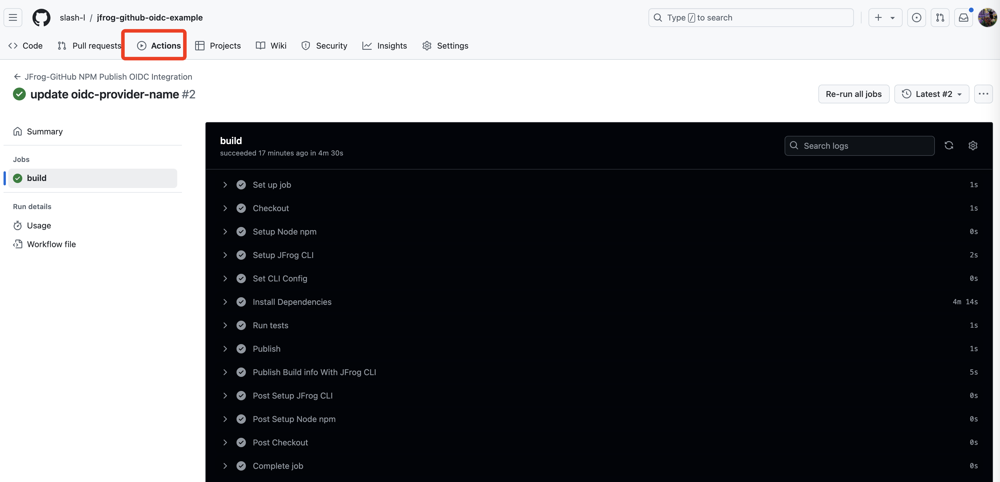

### JFrog Github OIDC Demo
#### 1 JFrog 配置
Manage Integration --> OIDC Integration  
新建 OpenID Connect

添加 Identity Mappings

#### 2 code
.github 下配置 Github Action pipeline yaml 文件

将 JFrog 生成的 代码片段 copy 至 pipeline yaml 文件中

#### 3 Github Action 运行
Github Actions 中运行

运行成功，npm demo 示例成功通过 JFrog 依赖下载外部组件并且 build 部署到 npm local 私有制品仓库中。

